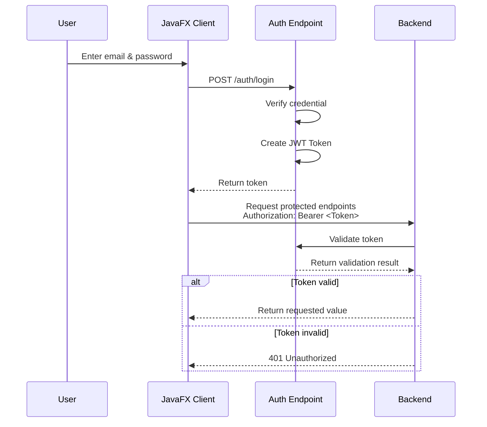

```mermaid
sequenceDiagram
  participant User as User
  participant Client as JavaFX Client
  participant Auth as Auth Endpoint
  participant Back as Backend

  User ->> Client: Enter email & password
  Client ->> Auth: POST /auth/login
  Auth ->> Auth: Verify credential
  Auth ->> Auth: Create JWT Token
  Auth -->> Client: Return token

  Client ->> Back: Request protected endpoints <br> Authorization: Bearer <Token>

  Back ->> Auth: Validate token
  Auth -->> Back: Return validation result

  alt Token valid
    Back -->> Client: Return requested value
  else Token invalid
    Back -->> Client: 401 Unauthorized
  end
```
