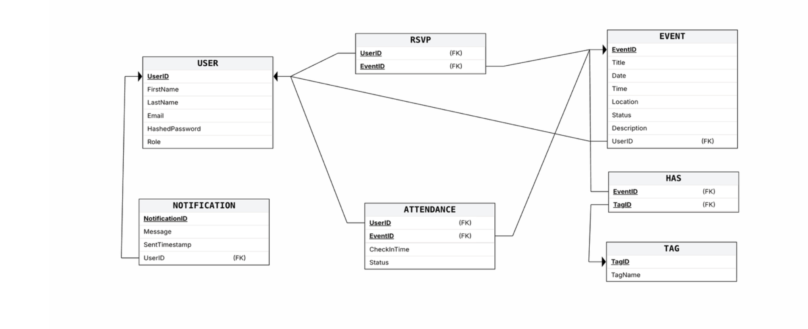
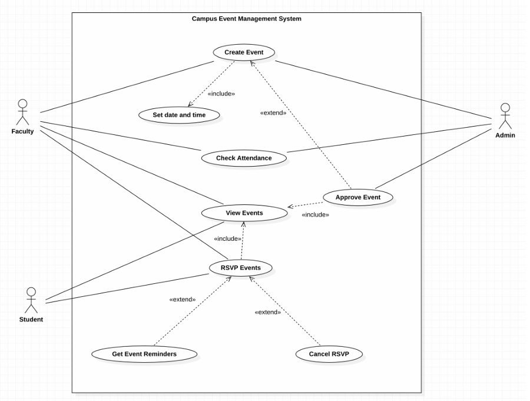
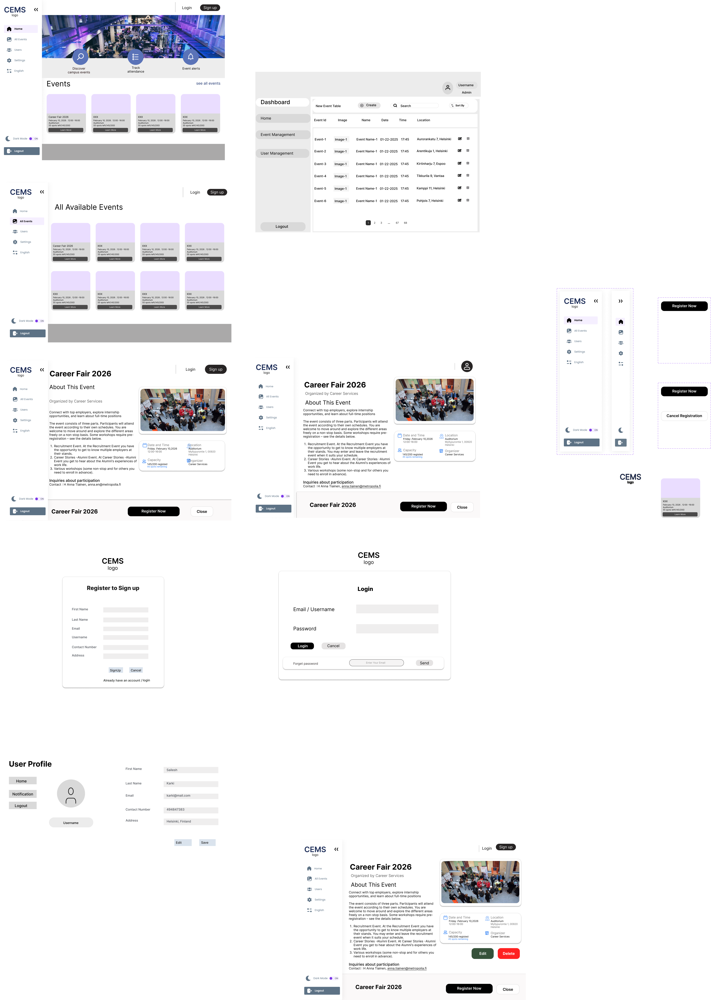

# Campus Event Management System (CEMS)

## Technical Project Report

### **Table of Contents**

## **1. Executive Summary**

### **1.1 Project Vision and Problem Statement**

### **1.2 Core Objectives and System Scope**

### **1.3 Scrum Team Composition and Agile Roles**

## **2. Project Lifecycle and Iterative Development**

### **2.1 Sprint 1: Planning and DevOps Foundations**

### **2.2 Sprint 2: Dependency Management and Core Implementation**

### **2.3 Sprint 3: Quality Assurance and Automated Testing**

### **2.4 Sprint 4: CI/CD Integration and Final Delivery**

## **3. System Architecture and Design**

### **3.1 High-Level Software Architecture (JavaFX & Spring Boot)**

### **3.2 Database Design and Entity Relationship Diagram (ERD)**

### **3.3 UI/UX Design Specifications (Figma Wireframes)**

#### **3.3.1 Role-Based Access Control (RBAC) in JavaFX**

### **3.4 Security Framework (JWT and Stateless Authentication)**

## **4. DevOps and Automated Workflow**

### **4.1 Version Control Strategy and Branching Model**

### **4.2 Continuous Integration (Jenkins Pipeline Implementation)**

### **4.3 Containerization Strategy (Docker Deployment Logic)**

### **4.4 SecDevOps and Automated Reporting**

## **5. Testing, Quality Assurance, and Validation**

### **5.1 Backend Unit Testing (Service and Controller Layers)**

### **5.2 Frontend Utility and Mapper Testing**

### **5.3 Code Coverage Analysis (JaCoCo Integration)**

## **6. Technical Implementation Details**

### **6.1 Project Directory Structure and Module Separation**

### **6.2 RESTFUl API Endpoint Documentation**

### **6.3 Shared Library and DTO Management**

## **7. Deployment and Installation Guide**

### **7.1 Prerequisites and Technical Dependencies**

### **7.2 Environment Variable Configuration (.env)**

### **7.3 Build and Local Execution Instructions**

## **8. Localization and Multi-Language Support**

### **8.1 Localization Overview**

### **8.2 Language Selection and Configuration**

### **8.3 Running Localized Versions**

### **8.4 Essential Localization Resources**

### **8.5 Adding New Languages**

### **8.6 Translation Best Practices**

### **8.7 Troubleshooting Localization Issues**

## **9. Project Conclusion**

## **9.1 Milestone Summary and Key Achievements**

### **9.2 Future Enhancements and Scalability Roadmap**

## **1. Executive Summary**

### **1.1 Project Vision and Problem Statement**

Students, faculty, and event organizers face difficulties keeping track of campus events due to scattered communication channels. Existing solutions lack a unified platform for event discovery, RSVP, and attendance tracking. Our product provides a simple campus management system where users can discover events, RSVP, track attendance, and receive notifications—streamlining participation and improving engagement.

### **1.2 Core Objectives and System Scope**

- Unified Discovery: Centralizing all university activities into a single interface.

- Automated Attendance: Replacing manual logs with a secure, real-time check-in system.

- Secure Interaction: Ensuring user data and event RSVPs are protected via modern authentication.

### **1.3 Scrum Team Composition and Agile Roles**

### **1.3 Scrum Team Composition and Agile Roles**

| Sprint       | Scrum Master           | Frontend Team                                                                       | Backend Team                          |
| :----------- | :--------------------- | :---------------------------------------------------------------------------------- | :------------------------------------ |
| **Sprint 1** | Puntawat Subhamani     | Jiya Kanhirathan Poyil , Sailesh Karki                                              | Aroush Irfan, Puntawat Subhamani      |
| **Sprint 2** | Aroush Irfan           | Jiya Kanhirathan Poyil , Sailesh Karki                                              | Aroush Irfan, Puntawat Subhamani      |
| **Sprint 3** | Jiya Kanhirathan Poyil | Aroush Irfan, Puntawat Subhamani, Ayo Williams                                      | Jiya Kanhirathan Poyil, Sailesh Karki |
| **Sprint 4** | Sailesh Karki          | Aroush Irfan, Puntawat Subhamani,Ayo Williams, <br/>Jiya Kanhirathan Poyil, Sailesh | Ayo Williams, Sailesh                 |

## **2. Project Lifecycle and Iterative Development**

This chapter documents the step-by-step evolution of the CEMS project through four distinct development cycles, following the course's DevOps-oriented workflow.

### **2.1 Sprint 1: Planning and DevOps Foundations**

Objective: Establish the collaborative environment and project baseline.

- Activities: Initialized the GitHub repository and configured the Trello board for task tracking.
- Outcome: Defined the core Scrum roles and completed the Week 1 Software Engineering basics assignment.

### **2.2 Sprint 2: Dependency Management and Core Implementation**

- Objective: Build the functional backbone of the system.
- Activities: Configured Maven for multi-module dependency management (Backend, Frontend, Shared) and began REST API development.
- Outcome: Successful implementation of the initial database schema and connection logic.

### **2.3 Sprint 3: Quality Assurance and Automated Testing**

- Objective: Ensure code reliability and system stability.
- Activities: Developed unit tests for controllers and services, including AttendanceControllerTest and AuthServiceTest.
- Outcome: Integrated JaCoCo for code coverage reporting and achieved initial CI pipeline milestones.

### **2.4 Sprint 4: CI/CD Integration and Final Delivery**

- Objective: Automate the deployment lifecycle and finalize the product.
- Activities: Configured the Jenkinsfile for automated build/test stages and created the Dockerfile for containerized execution.
- Outcome: Successful end-to-end integration of the RSVP and Attendance features, culminating in the final project presentation.

## **3. System Architecture and Design**


### **3.1 High-Level Software Architecture (JavaFX & Spring Boot)**

- Technology Stack: The system is built using JavaFX for the frontend, Spring Boot for the backend REST API, and MariaDB for relational data persistence.

- Modular Infrastructure: Deployment is managed through Dockerized environments and Jenkins CI/CD pipelines to ensure consistent application execution.

- Communication: The frontend interacts with the backend via the ApiEventService, ensuring a clean separation of concerns.

### **3.2 Database Design and Entity Relationship Diagram (ERD)**

- Relational Storage: MariaDB was selected for its reliability and team familiarity with relational database management.

- Schema Management: The database handles complex relationships, such as event-user associations, using optimized table structures.



- Visual Reference: For complete table mappings and foreign key relationships, refer to diagrams/ErDiagram.png.


### **3.3 UI/UX Design Specifications (Figma Wireframes**

-   - **User Flow**: The following diagram illustrates the interaction between Students, Faculty, and the System.

- ****

- User Experience: The UI is designed for intuitive event discovery, RSVP management, and attendance tracking.

- Component Mapping: Key views include specialized controllers for the navigation sidebar, event cards, and the attendance dashboard.

- Visual Reference: High-fidelity design mockups are located in diagrams/figma.png.



#### **3.3.1 Role-Based Access Control (RBAC) in JavaFX**

The CEMS application uses **State-Based View Switching** to render the correct dashboard for the authenticated user's role:

- **Student View**: Centered on event discovery and simplified participation.
- **Faculty View**: Elevated access to the event management modal and the attendance dashboard.
- **Admin View**: Restricted dashboard for oversight, log review, and final event approval.

### **3.4 Security Framework (JWT and Stateless Authentication)**

- Authentication: JWT (JSON Web Tokens) are implemented to provide secure, tamper-proof user sessions.

- Stateless Security: The backend utilizes an AuthFilter and JwtService to protect API endpoints and prevent unauthorized tampering with user tokens.

## **4. DevOps and Automated Workflow**

### **4.1 Version Control Strategy and Branching Model**

- Git Repository: We utilized Git for comprehensive version control, hosting the project on GitHub to facilitate asynchronous team collaboration.

- Branching Logic: Development was managed through feature-based branching (e.g., feature-frontend-dev), ensuring that the main branch remained a stable "production-ready" source.

- Consistency: Regular pull requests and merges ensured all team members were working on the most up-to-date version of the backend, frontend, and shared modules.

### **4.2 Continuous Integration (Jenkins Pipeline Implementation)**

- Pipeline-as-Code: A Jenkinsfile was implemented to define an automated CI/CD pipeline, standardizing the Build and Test environments.

- Automation Workflow: The pipeline triggers on every code commit, automatically running Maven commands to compile the project and execute the test suite.

- Reliability: This integration ensures that any breaking changes are caught early in the development lifecycle, preventing unstable code from reaching deployment.

### **4.3 Containerization Strategy (Docker Deployment Logic)**

- Image Management: We utilized Docker to package the Spring Boot backend and its dependencies into a single, portable container image.

- Deployment Blueprint: The Dockerfile provides a consistent environment blueprint, ensuring the application runs identically across local development, Jenkins, and production.

- Efficiency: Containerization simplifies the deployment process by bundling the Java runtime environment and application JAR into a lightweight, isolated unit.

### **4.4 SecDevOps and Automated Reporting**

- Security Integration: Security practices were integrated into the DevOps lifecycle, focusing on secure handling of .env variables and JWT secret management.

- Quality Reporting: The pipeline generates automated reports for build status and test failures, providing immediate feedback to the development team.

- Traceability: Every build is logged within the Jenkins environment, allowing for full traceability of features from the Trello board to the final containerized product.

## **5. Testing, Quality Assurance, and Validation**

### **5.1 Backend Unit Testing (Service and Controller Layers)**

- Service Logic Verification: We implemented robust unit tests for core business logic, including AttendanceServiceTest and AuthServiceTest, to ensure reliable check-in and authentication processes.

- API Endpoint Validation: Controller-level tests such as AttendanceControllerTest, EventControllerTest, and AuthControllerTest were used to verify that all REST endpoints handle requests and return correct HTTP status codes.

- Robustness: These tests ensure that the backend can gracefully handle valid data and reject invalid inputs before they reach the database.

### **5.2 Frontend Utility and Mapper Testing**

- Data Transformation: We utilized specific tests like AttendanceMapperTest and EventMapperTest to validate the logic that converts backend DTOs into JavaFX-compatible models.

- Utility Reliability: Core utility classes were tested to confirm that the communication layer between the frontend and backend remains stable during data fetching.

- UI Synchronization: These tests ensure that the data displayed in the AttendanceController and EventDetailController accurately reflects the state of the backend.

### **5.3 Code Coverage Analysis (JaCoCo Integration)**

- Coverage Measurement: The JaCoCo (Java Code Coverage) library was integrated to provide precise metrics on how much of our source code is exercised by our test suite.

- Automated Quality Reports: Code coverage is automatically calculated during the Jenkins pipeline execution, ensuring that quality standards are met before any build is finalized.

- Transparency: These reports offer the development team visual feedback on untested code paths, allowing for targeted testing in subsequent sprints.

## **6. Technical Implementation Details**

### **6.1 Project Directory Structure and Module Separation**

- Modularization: The project is structured as a multi-module Maven project to enforce a clear separation between the server-side logic and the client-side interface.

- Backend Module: Located in /backend, this module contains all Spring Boot controllers, services, repositories, and security configurations.

- Frontend Module: Located in /frontend, this module houses the JavaFX UI components, page controllers, and the API service layer.

- Shared Module: Located in /shared, this module contains common Data Transfer Objects (DTOs) used by both the backend and frontend to ensure data consistency.

### **6.2 RESTFUL API Endpoint Documentation**

- The following endpoints define the communication protocol between the JavaFX client and the Spring Boot server:

    | Feature             | Method   | Endpoint                          | Description                                                   |
    | :------------------ | :------- | :-------------------------------- | :------------------------------------------------------------ |
    | **Authentication**  | `POST`   | `/auth/login`                     | Authenticates users and generates a secure JWT.               |
    | **Events (Read)**   | `GET`    | `/events`                         | Fetches all available events for the discovery views.         |
    | **Events (Create)** | `POST`   | `/events`                         | Allows authorized organizers to create new campus activities. |
    | **Events (Update)** | `PUT`    | `/events/{id}`                    | Updates existing event details (e.g., time, location).        |
    | **Events (Delete)** | `DELETE` | `/events/{id}`                    | Removes an event from the system permanently.                 |
    | **Attendance**      | `GET`    | `/attendance/event/{id}`          | Retrieves the list of attendees for management.               |
    | **Attendance**      | `POST`   | `/attendance/event/{id}/check-in` | System-automated status update to "Checked In".               |
    | **RSVP**            | `POST`   | `/rsvp/event/{id}`                | Records a student's intent to attend an event.                |

- Attendance Management: Includes endpoints such as GET /attendance/event/{eventId} for fetching attendee lists and POST /attendance/event/{eventId}/check-in for recording attendance.

- Event Services: Provides routes for event discovery, including GET /events to list activities and POST /events for event creation.

- Authentication: Secured endpoints for user login and registration that utilize JWT for session management.

- RSVP Logic: Managed through the RsvpController, allowing users to register or cancel their participation in specific events.

### **6.3 Shared Library and DTO Management**

- Unified Models: The shared module defines core DTOs such as AttendanceDto, AuthDTO, and EventDto, which act as the standardized data contract between modules.

- Consistency: By using a shared library, the team avoids duplicating code and ensures that any changes to the data structure are automatically reflected in both the backend and frontend.

- Mapping Logic: Dedicated mappers in both modules handle the conversion between these shared DTOs and internal domain or UI models.

## **7. Deployment and Installation Guide**

This section outlines the steps required to set up the development environment and execute the CEMS application locally.

### **7.1 Prerequisites and Technical Dependencies**

- Java Development Kit (JDK): Version 21 or higher is required to compile and run the Spring Boot and JavaFX modules.

- Database Management System: A running instance of MariaDB is necessary for data persistence.

- Build Tool: Maven must be installed to manage dependencies across the multi-module project structure.

- Containerization: Docker Desktop is required if you intend to deploy the backend via a containerized environment.

### 7.2 Environment Variable Configuration (.env)\*\*

- Before launching the application, you must configure a .env file in the project root to manage sensitive credentials securely.

- Database Connection: Define your DB_URL, DB_USER, and DB_PASSWORD.

- Security Secret: Provide a unique JWT_SECRET string to enable the stateless authentication filter.

### **7.3 Build and Local Execution Instructions**

-Repository Setup: Clone the project repository and navigate to the project-cems root directory.

- Project Compilation: Run mvn clean install to build the shared, backend, and frontend modules and verify that all unit tests pass.

- Starting the Backend: Navigate to the backend/ directory and execute mvn spring-boot:run to start the REST API on the default port.

- Launching the Frontend: Navigate to the frontend/ directory and run the MainApp class to open the JavaFX user interface.

- Docker Deployment (Optional): Alternatively, use the Dockerfile to build and run the backend as a containerized service.

## **8. Localization and Multi-Language Support**

This section documents the multi-language implementation of the CEMS frontend application.

### **8.1 Localization Overview**

The CEMS frontend supports multiple languages, allowing users to select their preferred language during application use. The localization is implemented using Java's ResourceBundle mechanism with language-specific properties files.

**Supported Languages:**

- English (en_US) - Default
- Thai (th_TH)
- Urdu (ur_PK)

### **8.2 Language Selection**

#### **Selecting Language in the Application**

Users can change the application language from the **Sidebar**:

1. **Language Selector**: Locate the language dropdown menu in the sidebar.

2. **Select Language**: Choose from:
    - English
    - Thai
    - Urdu

3. **Apply**: The selected language takes effect immediately, and all UI text updates to the chosen language.

**Code Location**: Language handling is implemented in:

- `frontend/src/main/java/com/cems/frontend/utils/Language.java` - Enum defining supported languages and locales
- `frontend/src/main/java/com/cems/frontend/utils/LocaleUtil.java` - Singleton managing language switching
- `frontend/src/main/java/com/cems/frontend/controllers/components/SidebarController.java` - UI for language selection

### **8.3 Localization Architecture**

#### **Resource Bundle Structure**

Translation strings are organized in properties files located in `frontend/src/main/resources/com/cems/frontend/view/i18n/`:

```
i18n/
├── AllEvents.properties              # Base (English) for AllEvents view
├── AllEvents_en_US.properties        # English localization
├── AllEvents_th_TH.properties        # Thai localization
├── AllEvents_ur_PK.properties        # Urdu localization
├── Attendance.properties
├── Attendance_en_US.properties
├── Attendance_th_TH.properties
├── Attendance_ur_PK.properties
├── Bundles.properties                # Core bundle definitions
├── Bundles_en_US.properties
├── Bundles_th_TH.properties
├── Bundles_ur_PK.properties
├── EventDetail.properties
├── EventDetail_en_US.properties
├── EventDetail_th_TH.properties
├── EventDetail_ur_PK.properties
├── EventForm.properties
├── EventForm_en_US.properties
├── EventForm_th_TH.properties
├── EventForm_ur_PK.properties
├── EventManagement.properties
├── EventManagement_en_US.properties
├── EventManagement_th_TH.properties
├── EventManagement_ur_PK.properties
├── MainHome.properties
├── MainHome_en_US.properties
├── MainHome_th_TH.properties
├── MainHome_ur_PK.properties
├── UserManagement.properties
├── UserManagement_en_US.properties
├── UserManagement_th_TH.properties
├── UserManagement_ur_PK.properties
├── UserSettings.properties
├── UserSettings_en_US.properties
├── UserSettings_th_TH.properties
└── UserSettings_ur_PK.properties
```

Each properties file contains key-value pairs for translated strings:

```properties
main_home.hero.discover=Discover campus events
main_home.hero.track=Track Attendance
event.form.title=Create Event
```

#### **How Language Switching Works**

1. **LocaleUtil (Singleton Pattern)**: Manages the current application locale and provides resource bundles
2. **Language Enum**: Defines supported languages with their locales and optional font CSS
3. **ResourceBundle**: Java's built-in mechanism for loading language-specific properties files
4. **Scene Reload**: When language changes, the application reloads all UI elements with new translations

**Code Flow**:

```java
// User selects language from sidebar dropdown
LocaleUtil.getInstance().setLocale(Language.TH);

// LocaleUtil updates current locale
this.locale = Locale.forLanguageTag("th-TH");

// SceneNavigator reloads all scenes with new language
SceneNavigator.reloadNavigationView();

// Controllers load appropriate resource bundle
ResourceBundle rb = LocaleUtil.getInstance().getBundle(Paths.EVENT_DETAIL_VIEW);
// Automatically loads: EventDetail_th_TH.properties
```

### **8.4 Implementing Translations**

#### **Adding or Updating Translations**

1. **Locate the Properties File** for the view you want to translate:
    - `EventDetail.properties` (base/English)
    - `EventDetail_th_TH.properties` (Thai)
    - `EventDetail_ur_PK.properties` (Urdu)

2. **include the path to the Paths Enum** for the view you want to translate:
    - EVENT_DETAIL("pages/home-view.fxml","AllEvents"),

3. **Add/Update Key-Value Pairs**:

    ```properties
    # English (EventDetail.properties)
    event.detail.title=Event Details
    event.detail.location=Location

    # Thai (EventDetail_th_TH.properties)
    event.detail.title=รายละเอียดเหตุการณ์
    event.detail.location=ตำแหน่ง

    # Urdu (EventDetail_ur_PK.properties)
    event.detail.title=ایونٹ کی تفصیلات
    event.detail.location=مقام
    ```

4. **Use the Translation in Code**:

    ```java
    import com.cems.frontend.utils.LocaleUtil;
    import com.cems.frontend.models.Paths;

    public class EventDetailController {
        private ResourceBundle rb;

        @FXML
        public void initialize() {
            // Load resource bundle for current language
            rb = LocaleUtil.getInstance().getBundle(Paths.EVENT_DETAIL_VIEW);

            // Use translation
            titleLabel.setText(rb.getString("event.detail.title"));
            locationLabel.setText(rb.getString("event.detail.location"));
        }
    }
    ```

#### **Font Support for Non-Latin Scripts**

Thai language requires special font support due to its script complexity. A custom CSS file is applied:

- **File**: `frontend/src/main/resources/com/cems/frontend/view/css/thai.css`
- **Applied when**: User selects Thai language
- **Handled by**: `LocaleUtil.setFont()` method automatically applies/removes font CSS based on language

The Language enum specifies font CSS:

```java
TH("Thai", Locale.forLanguageTag("th-TH"), "/com/cems/frontend/view/css/thai.css"),
UR("Urdu", Locale.forLanguageTag("ur-PK")),  // Uses system default font
EN("English", Locale.US),                     // Uses system default font
```

### **8.5 Adding a New Language**

To add support for a new language (e.g., Italian - it_IT):

**1. Create Properties Files**

For each FXML view, create a localized properties file:

```bash
# Example: Create Italian translation for EventDetail view
copy frontend/src/main/resources/com/cems/frontend/view/i18n/EventDetail.properties \
     frontend/src/main/resources/com/cems/frontend/view/i18n/EventDetail_it_IT.properties

copy frontend/src/main/resources/com/cems/frontend/view/i18n/EventForm.properties \
     frontend/src/main/resources/com/cems/frontend/view/i18n/EventForm_it_IT.properties

# Repeat for all property files in the i18n directory
```

**2. Translate Content**

Open each `_it_IT.properties` file and translate all values:

```properties
# EventDetail_it_IT.properties
event.detail.title=Dettagli evento
event.detail.location=Posizione
event.detail.date=Data

# EventForm_it_IT.properties
event.form.title=Crea evento
event.form.name=Nome dell'evento
event.form.submit=Invia
```

**3. Update Language Enum**

Add the new language to `Language.java`:

```java
public enum Language {
    EN("English", Locale.US),
    TH("Thai", Locale.forLanguageTag("th-TH"), "/com/cems/frontend/view/css/thai.css"),
    UR("Urdu", Locale.forLanguageTag("ur-PK")),
    IT("Italian", Locale.forLanguageTag("it-IT"));  // Add this line

    // Rest of enum code...
}
```

**4. (Optional) Add Font CSS if Needed**

If the language requires special font rendering, create a font CSS file:

```css
/* frontend/src/main/resources/com/cems/frontend/view/css/italian.css */
* {
    -fx-font-family: "Segoe UI", "Arial", sans-serif;
}
```

Then update Language enum:

```java
IT("Italian", Locale.forLanguageTag("it-IT"), "/com/cems/frontend/view/css/italian.css")
```

**5. Test the Translation**

1. Build the project: `mvn clean install -pl frontend`
2. Run the frontend: `mvn javafx:run -pl frontend`
3. Select "Italian" from the language dropdown
4. Verify all UI text appears in Italian

**6. Commit Changes**

```bash
git checkout -b feature/i18n-italian
git add frontend/src/main/resources/com/cems/frontend/view/i18n/*_it_IT.properties
git add frontend/src/main/java/com/cems/frontend/utils/Language.java
git commit -m "Add Italian localization (i18n-it)"
git push origin feature/i18n-italian
```

### **8.6 Technical Details**

#### **Supported Locale Formats**

CEMS uses Java Locale naming conventions:

- `en_US` - English (United States)
- `th_TH` - Thai (Thailand)
- `ur_PK` - Urdu (Pakistan)
- `it_IT` - Italian (Italy)

---

## **9. Project Conclusion**

This final chapter summarizes the results of the CEMS project and outlines the strategic path for future development.

### **9.1 Milestone Summary and Key Achievements**

- End-to-End Integration: Successfully developed a multi-module system where a JavaFX client communicates securely with a Spring Boot REST API.

- Full CRUD Functionality: Implemented a complete event management lifecycle, allowing authorized users to Create, Read, Update, and Delete campus activities.

- Automated DevOps Pipeline: Established a robust CI/CD workflow using Jenkins and Docker, ensuring consistent builds and automated testing through every sprint.

- Security & Quality Standards: Achieved a secure, stateless authentication model via JWT and maintained high code reliability through JUnit 5 and JaCoCo coverage reporting.

### **9.2 Future Enhancements and Scalability Roadmap**

- Real-Time Notifications: Integrating a notification service to alert students of upcoming event schedules or changes to their RSVP status.

- Mobile-First Check-In: Expanding the platform with a mobile interface that utilizes QR code scanning for faster, localized attendance tracking.

- Cloud Infrastructure: Transitioning from a local Docker environment to a cloud provider (e.g., AWS or Azure) to support a larger, campus-wide user base.

- Advanced Analytics: Developing a dashboard for organizers to analyze attendance trends and student engagement levels across different event categories.
