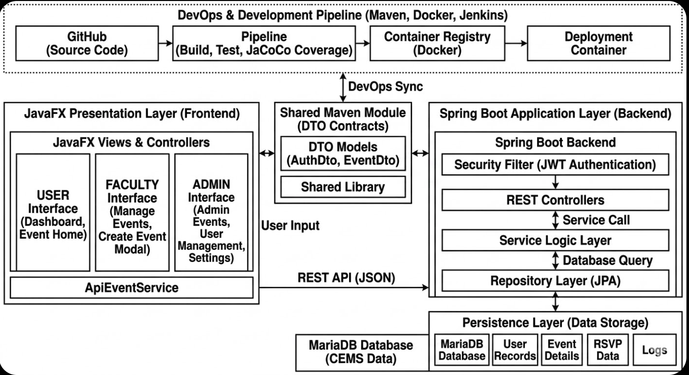
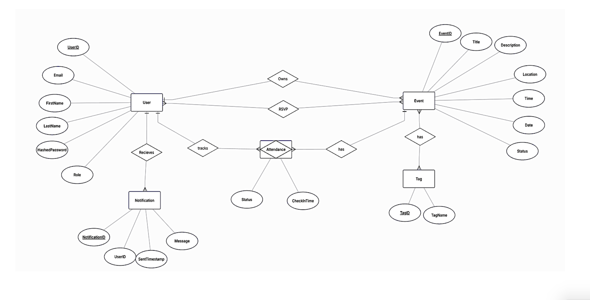
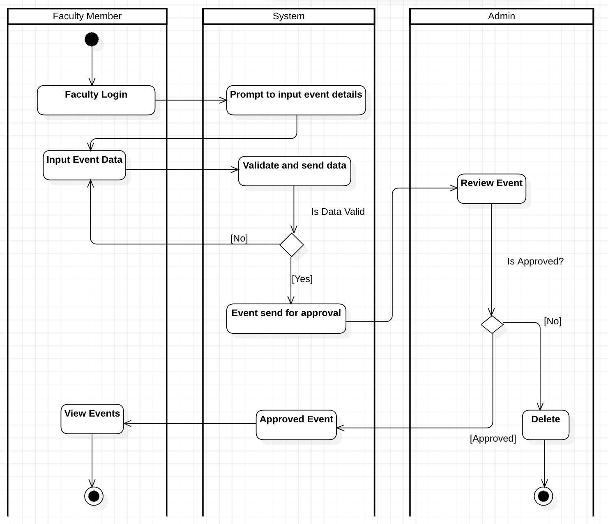
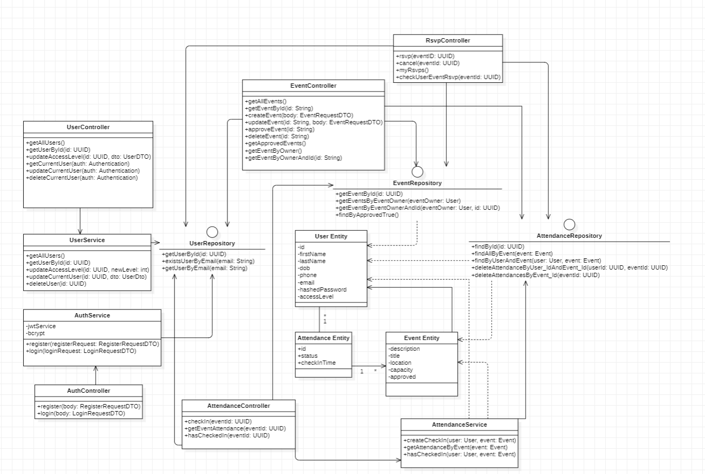
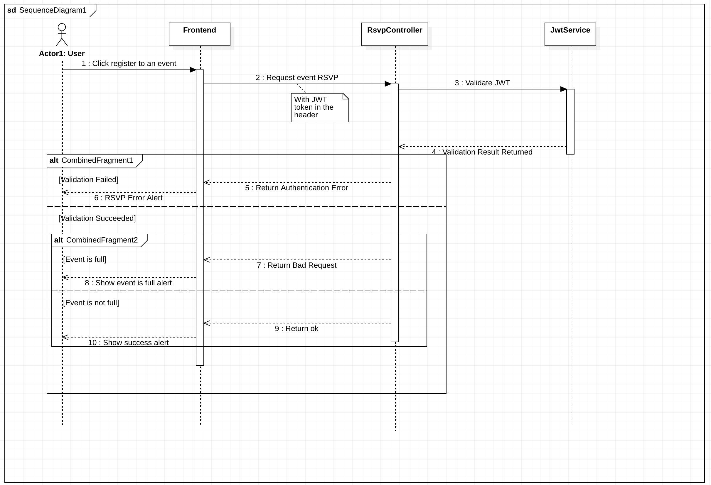

**Table of Contents**

- [1. Figma](#1-figma)
- [2. Diagrams](#2-diagrams)
  - [Use Case Diagram](#use-case-diagram)
  - [Architecture](#architecture)
  - [ER Diagram](#er-diagram)
  - [Relational Schema](#relational-schema)
  - [Activity Diagram](#activity-diagram)
  - [Class Diagram](#class-diagram)
  - [Sequence Diagram](#sequence-diagram)

## 1. Figma

## 2. Diagrams

### Use Case Diagram

### Architecture

### ER Diagram

### Relational Schema

### Activity Diagram

### Class Diagram

### Sequence Diagram

