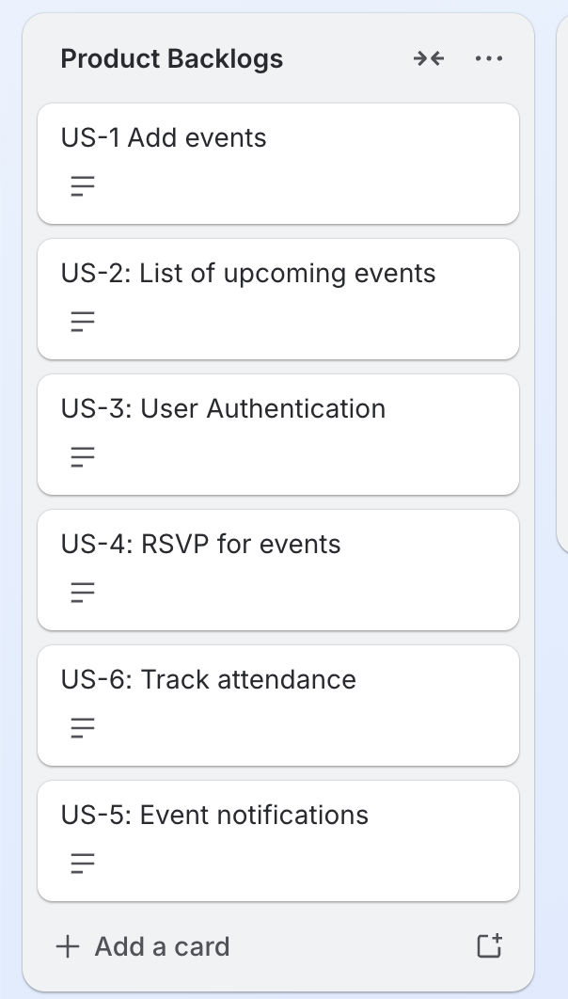

# Sprint 1: Foundational planning artifacts.

## Table of contents

- [Sprint 1: Foundational planning artifacts.](#sprint-1-foundational-planning-artifacts)
  - [Table of contents](#table-of-contents)
  - [1. Project plan summary](#1-project-plan-summary)
  - [2. Backlog creation](#2-backlog-creation)
  - [3. Project vision](#3-project-vision)
  - [4. Risk and scope definition](#4-risk-and-scope-definition)
    - [4.1 Risks](#41-risks)
      - [4.1.1 Technical and Infrastructure Risks](#411-technical-and-infrastructure-risks)
      - [4.1.2 Process and Pipeline Risks](#412-process-and-pipeline-risks)
    - [4.2 Scope](#42-scope)
  - [5. Detailed project plan](#5-detailed-project-plan)

## 1. Project plan summary

- **Document Type:** Project plan.

- **Project Name:** Campus Event Management System (CEMS).
- **Project Goals:** Develop a system to manage campus events.
- **Project Scope:** System for managing campus events. Includes CI/CD pipeline implementation using Jenkins, automated unit testing with JUnit, and application packaging via Docker.
- **Project Deliverables:** JavaFX application integrated with MariaDB, Jenkins file for automated build/test, Dockerfile for containerized deployment, JUnit tests and code coverage reports, and documentation including UML and ER diagrams.

## 2. Backlog creation

## 3. Project vision

[See project vision PDF](../../resources/projectVision.pdf)

## 4. Risk and scope definition

### 4.1 Risks

#### 4.1.1 Technical and Infrastructure Risks

- **Risk: Environment Inconsistency**
  - **Description:** Differences in local Java or Maven configurations among the four members causing build failures.
  - **Likelihood:** Medium
  - **Impact:** High
  - **Mitigation:** The team will utilize a standard pom.xml file and leverage docker to ensure environmental parity.

- **Risk: Database Connectivity Failures**
  - **Description:** Failure to establish a stable JDBC connection between the Java application and MariaDB, particularly within a Docker network.
  - **Likelihood:** Medium
  - **Impact:** High
  - **Mitigation:** The team will implement environment-based configuration files and conduct early integration testing in Sprint 2.

#### 4.1.2 Process and Pipeline Risks

- **Risk: CI/CD Pipeline Configuration Errors**
  - **Description:** Technical hurdles in configuring Jenkins triggers or automated test execution scripts.
  - **Likelihood:** High
  - **Impact:** Medium
  - **Mitigation:** The team will strictly follow course demonstrations and use the mandatory temperature converter application as a baseline for pipeline configuration.

- **Risk: Scope Creep and Time management**
  - **Description:** Attempting to implement non-essential features that delay the delivery of mandatory DevOps components.
  - **Likelihood:** Low
  - **Impact:** Medium
  - **Mitigation:** The Scrum Master will ensure strict adherence to the Product Backlog and prioritize tasks in Trello during each sprint Planning meeting.

---

### 4.2 Scope

- **Functional Scope:** This system support two primary user roles: Students as: viewer or attendees and Teachers or Admin as: organizers. The key functionalities include user authentication, a centralized event dashboard, RSVP submission, and attendance tracking.

- **Technical Scope:** Technical Scope: This project implementation is restricted to a three-tier architecture using Java (JavaFX UI), MariaDB for relational data management, and JDBC for database connectivity.

- **DevOps Scope:** This project scope extends beyond code to include the implementation of a CI/CD pipelining using Jenkins, automated unit testing with JUnit, and application packaging via Docker.

## 5. Detailed project plan

[Project plan](../../resources/projectPlan.pdf)
