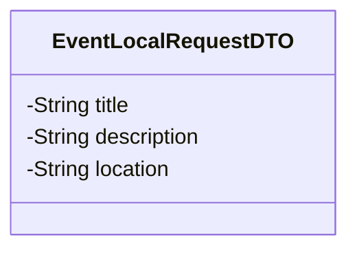

# Sprint 6

## Table of Contents

- [Sprint 6](#sprint-6)
  - [Table of Contents](#table-of-contents)
  - [1. Database Localization](#1-database-localization)
    - [1. Database localization plan and implementation report.](#1-database-localization-plan-and-implementation-report)
    - [2. Documentation](#2-documentation)
  - [2. Statistical Code Review](#2-statistical-code-review)
  - [3. Code Clean-up and Refactoring](#3-code-clean-up-and-refactoring)
    - [Backend Cleanup \& Improvements](#backend-cleanup--improvements)
    - [Key Improvements:](#key-improvements)
    - [Module Cleanup](#module-cleanup)
    - [New Test Suites](#new-test-suites)
    - [Better API Standards](#better-api-standards)
    - [Documentation \& Constants](#documentation--constants)
    - [General Codebase Cleanup](#general-codebase-cleanup)
    - [Final Metrics](#final-metrics)
    - [Frontend](#frontend)
    - [HTTP Request Handling and Code Reuse](#http-request-handling-and-code-reuse)
    - [Attendance Service Refactor and Improvements (AttendanceService.java):](#attendance-service-refactor-and-improvements-attendanceservicejava)
  - [4. Acceptance Test Planning](#4-acceptance-test-planning)
  - [5. Architecture Design Documentation](#5-architecture-design-documentation)
  - [6. Contributions](#6-contributions)

## 1. Database Localization

### 1. Database localization plan and implementation report.

- Set the database to use UTF-8

```sql
ALTER DATABASE cems
CHARACTER SET = utf8mb4
COLLATE = utf8mb4_unicode_ci;
```

- Add extra table to the database for Event details localization so that the user can add localization for different languages

```sql
CREATE TABLE event_translation
(
    id            BINARY       NOT NULL,
    title         VARCHAR(255) NULL,
    `description` VARCHAR(255) NULL,
    location      VARCHAR(255) NULL,
    language      VARCHAR(255) NULL,
    ref_event_id  BINARY(16)   NOT NULL,
    CONSTRAINT pk_eventtranslation PRIMARY KEY (id)
);
```

### 2. Documentation

**1. UTF-8 Support at Database Level**

The database is configured to use utf8mb4 character encoding:

```sql
ALTER DATABASE cems
CHARACTER SET = utf8mb4
COLLATE = utf8mb4_unicode_ci;
```

- Ensure all unicode characters are supported (for Thai script and Urdu Nastaʿlīq)
- Provides consistent sorting and comparison rules via utf8mb4_unicode_ci.

**2. A dedicated table (`event_translation`) is used to store localized content:**

```sql
CREATE TABLE event_translation
(
    id            BINARY       NOT NULL,
    title         VARCHAR(255) NULL,
    `description` VARCHAR(255) NULL,
    location      VARCHAR(255) NULL,
    language      VARCHAR(255) NULL,
    ref_event_id  BINARY(16)   NOT NULL,
    CONSTRAINT pk_eventtranslation PRIMARY KEY (id)
);
```

- Original data remains unchanged
- Scalable, new language can be added with minimal effort

**Database can be retrieve, created, or updated from backend by using REST API requests on these endpoints:**

Get all events' details in a language: `GET: /events/all/{lang}`<br>
Get an event's detail in a language: `GET: /events/{id}/{lang}`<br>
Add or update event's localized data: `PUT: /events/{id}/{lang}`

All localized data can be updated using this DTO for REST API:<br>
at: `com.cems.shared.model.EventDTO.EventLocalRequestDTO`



## 2. Statistical Code Review

See: [Statistical Code Review](./StatisticalCodeReview.md)<br>
Graphical Summary:


## 3. Code Clean-up and Refactoring

### Backend Cleanup & Improvements

Resolved **170+ Checkstyle violations** across **17 core backend files**. The branch is now fully compliant with the Google Java Style guide, ensuring a zero-warning build for the Attendance and Event modules.

### Key Improvements:

- **Namespace Integrity:** Replaced all wildcard (.\*) imports with explicit declarations to avoid namespace pollution and improve build performance.

- **Defensive Logic:** Enforced mandatory braces {} for all conditional blocks across controllers and services, reducing the risk of logic errors.

- **Framework Compatibility:** Managed complex conflicts between Spring Data JPA naming conventions and Checkstyle rules using targeted suppressions, preserving system functionality while achieving style compliance.

- **Documentation Debt:** Added Javadoc headers to all 17 classes and their public methods, significantly improving the maintainability of the codebase.

### Module Cleanup

- Performed a full cleanup across the **Event**, **Auth**, and **User** modules.
- Improved logic structure, removed code smell, and reorganized components for better maintainability.
- Result: a cleaner, more consistent backend architecture.

### New Test Suites

- Added new test suites for **Event** and **RSVP** flows.
- Strengthened validation around registration, event management, and edge-case handling.
- Increased reliability of two core application features.

### Better API Standards

- Improved type‑safety, security, and consistency across endpoints.
- Converted mappers into **utility classes** to streamline data flow.

### Documentation & Constants

- Added **JavaDocs** to services and repositories for clearer onboarding and future maintenance.
- Moved hardcoded values into **constants** to reduce duplication and improve consistency.

### General Codebase Cleanup

- Cleaned up ~17 files across the project.
- Standardized imports, naming conventions, and formatting.
- Ensured consistent structure and readability throughout the codebase.

### Final Metrics

- **Initial Violations:** ~172

- **Final Violations:** **0**

- **Build Status:** BUILD SUCCESSFUL with no static analysis warnings.

### Frontend

### HTTP Request Handling and Code Reuse

- Replaces direct use of HttpRequest.newBuilder() and manual header management with the centralized LocalHttpClientHelper.buildRequest utility for all HTTP operations. This reduces duplication and ensures consistent request construction.
- Uses a shared, pre-configured ObjectMapper from LocalHttpClientHelper for consistent JSON serialization.
- **Error Handling and Status Codes**
- Replaces generic exceptions and RuntimeException with more specific IOException for all error cases, and consistently checks HTTP status codes using the new HttpStatus enum.
- Handles special cases such as unauthorized access by logging out the user and returning an empty result.
- **Documentation and Readability**
- Adds detailed Javadoc comments to all public methods, clarifying their behavior, parameters, and error handling.
- Refactors variable names and code structure for clarity and maintainability.

### Attendance Service Refactor and Improvements (AttendanceService.java):

- **HTTP Request Handling and Error Management**
- Refactors all HTTP operations to use LocalHttpClientHelper.buildRequest and the HttpStatus enum for clearer, less error-prone status handling.
- Replaces RuntimeException with IOException for error cases, and removes unnecessary try-catch blocks.
- **Documentation and Code Quality**
- Add Javadoc comments to all public methods, improving code self-documentation and onboarding for new developers.
- Cleaned up and simplified method implementations for better readability.

## 4. Acceptance Test Planning

See: [Acceptance Test Plan](./Acceptance_Test_Plan.md)

## 5. Architecture Design Documentation

See: [Diagrams and Resources](../../resources/README.md)

## 6. Contributions

| Team Member Name        | Assigned Tasks                                  | Time Spent (hours) | In-class tasks |
| ----------------------- | ----------------------------------------------- |--------------------| -------------- |
| Puntawat (Scrum master) | Database localization & Statistical code review | 21                 | Submitted      |
| Aroush                  | Frontend code cleanup                           | 12                 | Submitted      |
| Ayokunle                | Frontend code cleanup, Acceptance test planning | 18                   | Submitted      |
| Jiya Jameela            | Backend code cleanup, Acceptance test planning  | 17                 | Submitted      |
| Sailesh                 | Backend code cleanup                            | 18                 | Submitted      |
