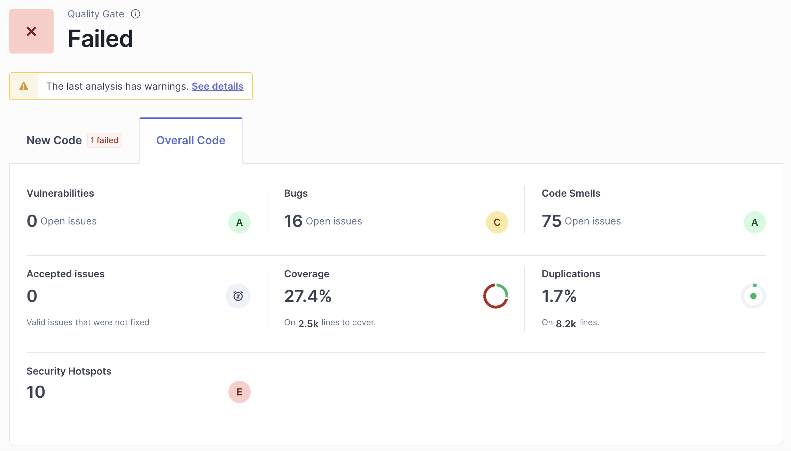
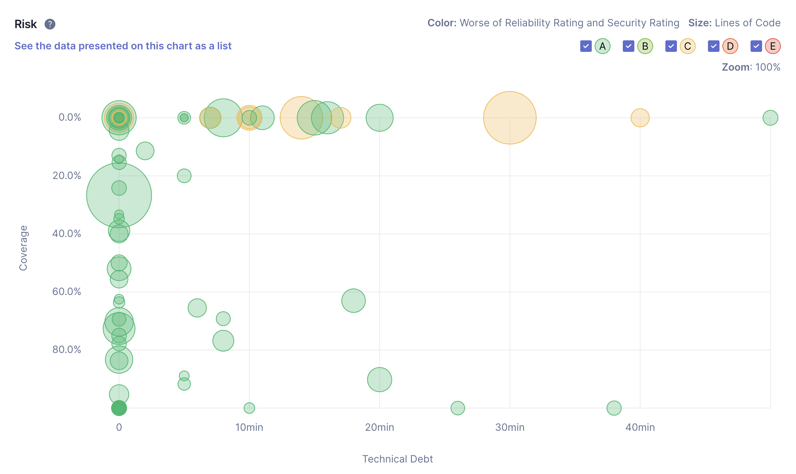

# Statistical Code Review

## Summary Metrics

### 1. Bugs (16 bugs): All bugs are

```
Either re-interrupt this method or rethrow the "InterruptedException" that can be caught here.
```

### 2. Code Smells (75 Code Smell):

- Unused local variables
- Not defining a constant instead of duplicating string literals
- Useless assignment to variables
- System.out is used instead of a logger
- Unused method parameters

### 3. Cyclomatic complexity: 905

### 4. Lines of code per method (>50 lines): No Issues

### 5. Diplicate codes: (1.7%, 138 lines)

### 6. Unreachable codes: No unreachable codes

## Key findings and suggested improvements

### 1. Metrics

- Security: A
- Reliability: C
  - 16 Major bugs
- Maintainability: A
  - Code Smells: 75
  - Debt: 7h 41 min
  - Debt Ratio: 0.3%
  - Effort to Reach A: 0
- Security Review: E
  - 10 Security Hotspots
    - Do not use `e.printStackTrace();`
- Coverage: 27.4%

### 2. Major bugs

- InterruptedException must be rethrown or re-interrupt.

### 3. Code Smells

- Remove unused local variables
- Define constant variables for repeated values
- Remove useless variable assignments
- Remove unused method parameters

### 4. High Priority Issues (ordered by priority)

- Review security hotspots
- Fix major bugs
- Improve coverage
- Fix code smells

## Visual evidence (screenshots, charts)



