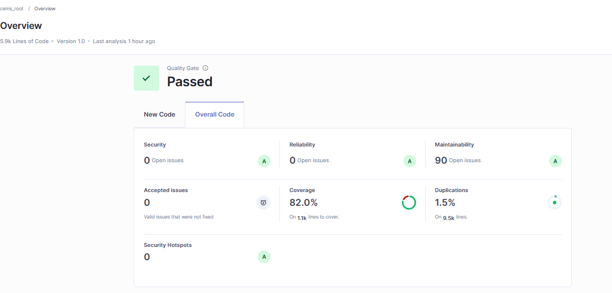

# Sprint 7 Deliverable Report

## 1. Summary of Work Done
- Completed Sprint 7 tasks as planned in Trello.
- Performed testing activities (unit tests, UAT, heuristic evaluation).
- Fixed identified issues and improved overall code quality.
- Generated updated SonarQube reports through Jenkins.
- Updated project documentation (package diagram, ER diagram, relational schema).

---

## 2. Functional Task Details
- Implemented final feature refinements based on Sprint 7 requirements.
- Addressed user stories assigned for this sprint.
- Resolved bugs discovered during testing.  
[Bug Tracking Table](./bugs_tracking.md)
- Completed unit testing.
- Included screenshots of SonarQube analysis results from Jenkins.  

---

## 3. Non‑Functional Task Details
- Conducted performance testing and applied minor optimizations.
- Completed heuristic evaluation of the product.
- Performed User Acceptance Testing (UAT) and documented results.
- Reviewed security aspects and noted any vulnerabilities found.
---

## 4. Documentation Updates
- Updated package diagram.
- Updated ER diagram and relational schema.
- No changes to system architecture.

---

## 5. Contributions

| Team Member Name                               | Assigned Tasks                                                                                                                                                       | Time Spent (hrs) | In‑class Tasks |
|------------------------------------------------|----------------------------------------------------------------------------------------------------------------------------------------------------------------------|------------------|----------------|
| Aroush Irfan (Scrum Master)                    | Test plan creation, unit testing (FE controllers & BE views), heuristic evaluation, UAT execution, Jenkins update                                                    | 22               | Submitted      |
| Ayokunle Ogunbiyi                              |                                                                                                                                                                      |                  | Submitted      |
| Jiya Jameela Kanhirathan Poyil                 | unit testing ( FE utils & BE mappers and helpers), heuristic evaluation, UAT execution, SonarQube Static Analysis                                                    | 10               | Submitted      |
| Puntawat Subhamani                             |     Move logic out of controllers and test, ER/Relational Schema diagram/Heuristic Evaluation, User Acceptance Testing, Fix Security Hotspots and bugs on controllers                                                                                                                                                                 |    19               | Submitted      |
| Sailesh Karki                                  | User Acceptance Testing (UAT), Front-end & Back-end Debugging, and added Tests, SonarQube Static Analysis, Checkstyle Code Refactoring Jenkins CI/CD Pipeline Setup. | 11               | Submitted      |

